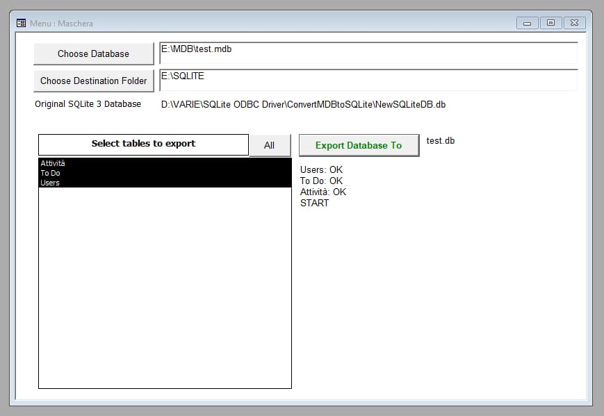

# How To Export Mdb To SQLite3

`My notes on how to convert MDB files to an SQLite database`

Download:
- [ExportMDBToSQLite3.mdb](export-mdb-to-sqlite3/ExportMDBToSQLite3.mdb)
- [NewSQLiteDB.db](export-mdb-to-sqlite3/NewSQLiteDB.db)

Launch **ExportMDBToSQLite3.mdb**

Choose the mdb file, the tables to export, then the destination folder. Click _export database to_ to export the tables selected.
